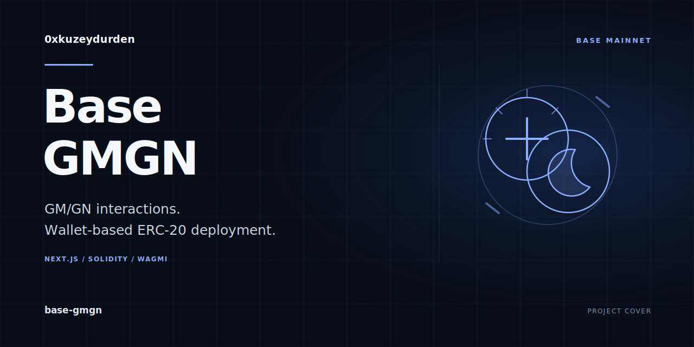

# Base GMGN

[](https://github.com/0xkuzeydurden/base-gmgn/actions/workflows/ci.yml)

A wallet-connected dApp for GM/GN interactions and ERC20 deployment on Base mainnet.
The project combines a Next.js interface with Solidity contracts built using Hardhat.



## Features

- Send GM/GN transactions and display contract counters and transaction status.
- Deploy an ERC20 token from the connected wallet with a name, symbol, and initial supply.
- Connect wallets using RainbowKit, wagmi, and viem, with Base network checks.
- Rebuild the contract ABIs and bytecode used by the frontend from the Solidity source.

The ERC20 contract also exposes an owner-only `mint` function. The current frontend
provides token deployment; it does not provide a separate minting form.

## Local development

Use Node.js 22. The workspace pins `pnpm@8.15.4` in `package.json`.

```bash
git clone https://github.com/0xkuzeydurden/base-gmgn.git
cd base-gmgn
pnpm install
```

Create `packages/web/.env.local` and supply your WalletConnect project ID:

```dotenv
NEXT_PUBLIC_WALLETCONNECT_PROJECT_ID=your_project_id
```

```bash
pnpm dev
```

The root development command compiles the contracts, copies the ABI and bytecode
files into the web package, and starts the Next.js development server.

## Network and contract configuration

The frontend targets **Base mainnet, chain ID 8453**. Wallet transactions use real
funds and require confirmation in the connected wallet.

| Setting | Location |
| --- | --- |
| Chain definition | `packages/web/lib/chains.ts` |
| WalletConnect and RPC transport | `packages/web/lib/wagmi.ts` |
| GMGN contract address | `GMGN_ADDRESS` in `packages/web/components/GMGNCard.tsx` |
| Contract source | `packages/contracts/contracts/` |
| Generated frontend ABI and bytecode | `packages/web/lib/abis/` |

The GMGN address is currently a source-code constant. The application does not
read a `NEXT_PUBLIC_GMGN_ADDRESS` environment variable or expose an address editor.
Update the constant when using another compatible deployment.

Variables prefixed with `NEXT_PUBLIC_` are exposed to the browser. Do not place
wallet private keys or other server secrets in them.

## Commands

| Command | Purpose |
| --- | --- |
| `pnpm dev` | Compile contracts, refresh frontend artifacts, and run the development server |
| `pnpm build` | Compile contracts, refresh frontend artifacts, and build the web application |
| `pnpm --filter @base-dapp/contracts build` | Compile contracts and copy ABI/bytecode files |
| `pnpm --filter @base-dapp/web start` | Serve an existing Next.js production build |

## Repository layout

- `packages/contracts/` — Solidity contracts, Hardhat configuration, and artifact-copy script.
- `packages/web/` — Next.js application, wallet integration, and interface components.
- `netlify.toml` — Netlify configuration for the Next.js application.

The checked-in Netlify command builds only the web package. When contract source
changes, run the root build and keep the frontend ABI/bytecode files synchronized
before deploying.

## Project status

This is an experimental application. The repository currently contains no automated
test suite. Contract behavior and wallet flows should be validated before relying
on a deployment with funds.

## Continuous integration

The CI workflow installs dependencies from the lockfile, compiles the contracts,
builds the Next.js application with its TypeScript checks, and typechecks the
contract tooling. These checks do not deploy contracts or require wallet keys.
